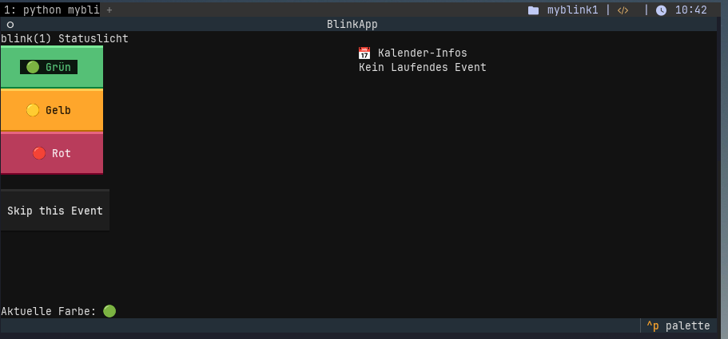

# myblink1

Here is a simple script to control my [blink(1)](https://blink1.thingm.com/). It uses the google calendar API to color the LED differently depending on upcoming or ongoing meetings. On the one hand, this can be used to draw attention to the next appointment yourself, but it can also be used to inform colleagues who pass by your desk whether you are currently available or in a meeting (or have to go to one shortly).

The UI is made in the terminal using *textual*. This still needs some improvements.

## Setup

1. Generate a Google calendar API key
2. place the credentials.json in the working dir 
3. start the script --> will open a browser window and ask you to log in to google 
4. Done

## What could be added? 

- Blinking color depending on different event types
- Set LED to red as soon a ongoing call is detected on the host machine (maybe hard to do ...)
